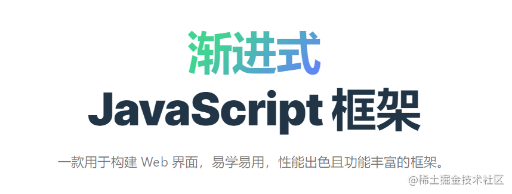
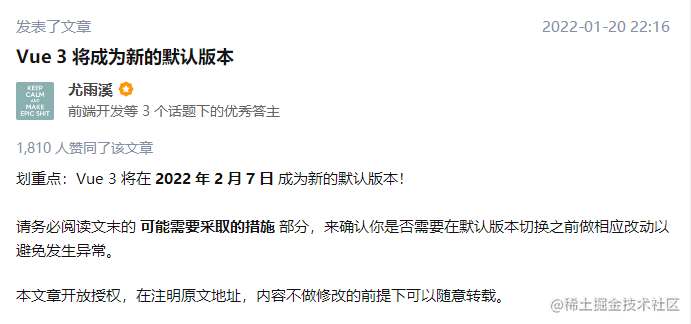
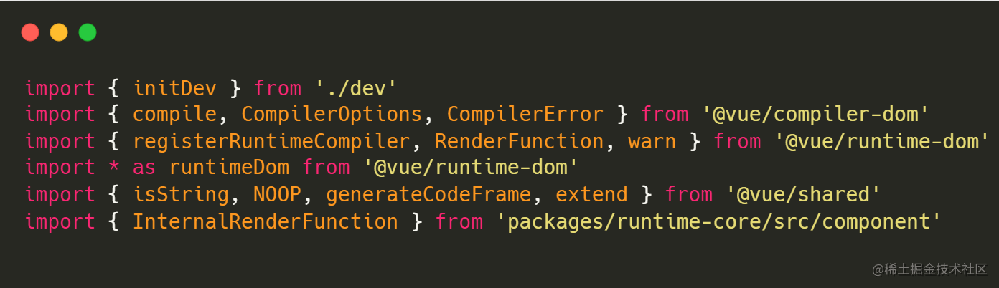
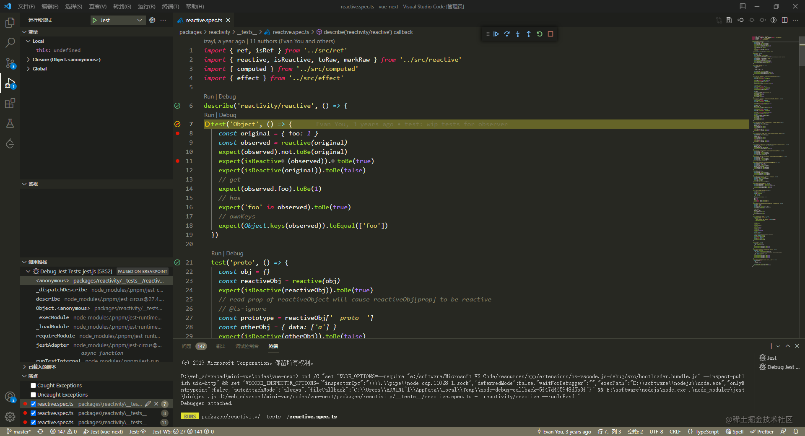
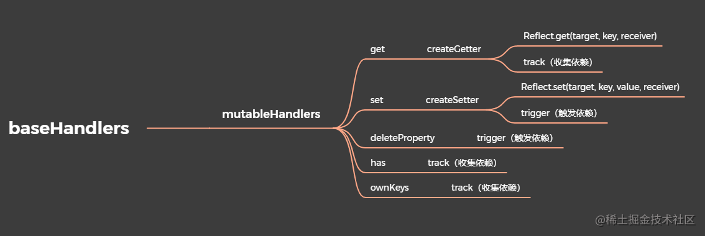
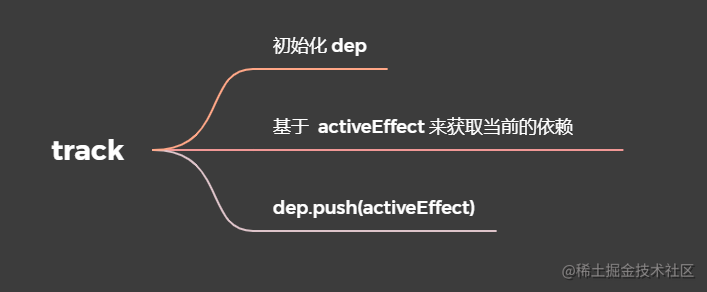
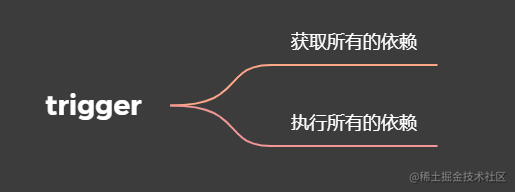
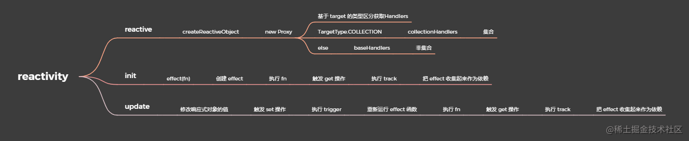

# reactivity

## 前言
不久前，**尤大**官宣**Vue3**将在**2022年2月7日**成为**新的默认版本**。对大多数的前端人来说，Vue3的学习已是势在必行。

  
这篇文章将记录通过[大崔哥](https://space.bilibili.com/175301983)的[mini-vue](https://github.com/cuixiaorui/mini-vue)，学习Vue3源码过程中的那些事儿，今天主要讲讲**reactivity**的核心流程。开篇之前我们先来说说**Vue3的源码结构**。  

本文掘金地址传送门：**[Vue3的源码学习系列之reactivity](https://juejin.cn/post/7058965986363326472)**

## Vue3源码的结构
我认为，学习一门语言源码之前，了解其代码结构还是很有必要的。\
从Vue3的源码工程来看，**Vue3的源码结构**主要分为**编译阶段**和**运行时阶段**。



**编译阶段**由`@vue/compiler-sfc`包来解析`*.vue`文件，每个`*.vue`文件中`<template>`块的内容会被提取出来并传递给`@vue/complier-dom`包（依赖于`@vue/compiler-core`包），预编译为JavaScript的渲染函数，并附属到导出的组件上作为其`render`选项。\
\
**运行时阶段**由`@vue/runtime-dom`包来解析dom节点上的内容，其底层依赖于`@vue/runtime-core`包。\
\
最后由`@vue/reactivity`实现Vue的响应式。


# reactivity的核心流程
进入reactivity的核心流程学习之前，我们可以先了解一下**reactive**的使用，以及官网对于[reactive](https://v3.cn.vuejs.org/api/basic-reactivity.html#reactive)的描述。


这篇文章中，我将用**断点调试**的方法来梳理**reactivity**模块的核心流程。

如果你也使用**vscode**，那么你可以安装**Jest**和**Jest Runner**这两个插件来启动测试用例。**打好断点**之后，**按F5**，测试用例便会运行，调试器就会停在断点的位置。


## 第一步：创建响应式对象
从**reactivity**的单元测试文件`packages/reactivity/_tests_/reactive.spec.ts`入手。

```ts
describe('reactivity/reactive', () => {
  test('Object', () => {
    const original = { foo: 1 }
    // 创建响应式对象
    const observed = reactive(original)
    expect(observed).not.toBe(original)
    expect(isReactive(observed)).toBe(true)
    expect(isReactive(original)).toBe(false)
    // get
    expect(observed.foo).toBe(1)
    // has
    expect('foo' in observed).toBe(true)
    // ownKeys
    expect(Object.keys(observed)).toEqual(['foo'])
  })
  ...
})
```
通过代码我们可以知道，`reactive函数`接收到一个`target对象`，由`createReactiveObject函数`将其转换为一个`Proxy对象`。

```ts
function createReactiveObject(
  target: Target,
  isReadonly: boolean,
  baseHandlers: ProxyHandler<any>,
  collectionHandlers: ProxyHandler<any>,
  proxyMap: WeakMap<Target, any>
) {
  // 核心就是 proxy
  // 目的是可以侦听到用户 get 或者 set 的动作
  if (!isObject(target)) {
    if (__DEV__) {
      console.warn(`value cannot be made reactive: ${String(target)}`)
    }
    return target
  }
  // target is already a Proxy, return it.
  // exception: calling readonly() on a reactive object
  if (
    target[ReactiveFlags.RAW] &&
    !(isReadonly && target[ReactiveFlags.IS_REACTIVE])
  ) {
    return target
  }
  // target already has corresponding Proxy
  const existingProxy = proxyMap.get(target)
  if (existingProxy) {
    return existingProxy
  }
  // only a whitelist of value types can be observed.
  const targetType = getTargetType(target)
  if (targetType === TargetType.INVALID) {
    return target
  }
  // baseHandlers -> 处理器
  const proxy = new Proxy(
    target,
    targetType === TargetType.COLLECTION ? collectionHandlers : baseHandlers
  )
  // 把创建好的 proxy 给存起来
  proxyMap.set(target, proxy)
  return proxy
}
```
### collectionHandlers
**collectionHandlers**针对的是集合数据类型(即`set、map、weakSet、weakMap`)，以此来解决[Proxy的局限性](https://javascript.info/proxy#proxy-limitations)。文件路径在`packages/reactivity/src/collectionHandlers.ts`。

其处理器主要包含三种:
+ `mutableCollectionHandlers`(普通响应式数据)
+ `shallowCollectionHandlers`(浅层响应式数据)
+ `readonlyCollectionHandlers`(只读响应式数据)。
核心的代码如下：
```ts
//该方法的主要作用就是通过instrumentations实现数据劫持
function createInstrumentationGetter(isReadonly: boolean, shallow: boolean) {
  const instrumentations = shallow
    ? isReadonly
      ? shallowReadonlyInstrumentations
      : shallowInstrumentations
    : isReadonly
    ? readonlyInstrumentations
    : mutableInstrumentations

  return (
    target: CollectionTypes,
    key: string | symbol,
    receiver: CollectionTypes
  ) => {
    if (key === ReactiveFlags.IS_REACTIVE) {
      return !isReadonly
    } else if (key === ReactiveFlags.IS_READONLY) {
      return isReadonly
    } else if (key === ReactiveFlags.RAW) {
      return target
    }

    // 返回Reflect.get()处理后的方法
    // 如果是 get has add set delete clear forEach 的方法调用，或者是获取size，那么改为调用mutabelInstrumentations里的相关方法
    return Reflect.get(
      hasOwn(instrumentations, key) && key in target
        ? instrumentations
        : target,
      key,
      receiver
    )
  }
}
```

### baseHandlers
从上述的代码中，**baseHandlers**就是响应式对象的处理器。文件路径在`packages/reactivity/src/baseHandlers.ts`。


该文件主要是将**mutableHandlers**变量导出，该变量含有`get、set、deleteProperty、has、ownKeys`等方法。
```ts
export const mutableHandlers: ProxyHandler<object> = {
  get,
  set,
  deleteProperty,
  has,
  ownKeys
}
```
+ createGetter
```ts
// 创建get方法。isReadonly 是否只读，shallow是否是浅层
function createGetter(isReadonly = false, shallow = false) {
  return function get(target: Target, key: string | symbol, receiver: object) {
    ... ...
    //判断是否为数组, 实际就是调用 Array.isArray(target)
    const targetIsArray = isArray(target)

    if (!isReadonly && targetIsArray && hasOwn(arrayInstrumentations, key)) {
      return Reflect.get(arrayInstrumentations, key, receiver)
    }
    // 拿到结果
    const res = Reflect.get(target, key, receiver)

    // 判断是否是 symbol
    // builtInSymbols: symbol 类 上的一些symbol类型的属性，例如迭代器 symbol.iterator
    if (isSymbol(key) ? builtInSymbols.has(key) : isNonTrackableKeys(key)) {
      return res
    }

    // 如果不是只读的，则进行依赖收集
    if (!isReadonly) {
      track(target, TrackOpTypes.GET, key)
    }

    //如果是浅层的，则直接返回
    if (shallow) {
      return res
    }
    ... ...
    return res
  }
}
```
+ createSetter
```ts
// 创建set方法。shallow 参数标识是否为浅层
function createSetter(shallow = false) {
  return function set(
    target: object,
    key: string | symbol,
    value: unknown,
    receiver: object
  ): boolean {
    //获取旧值
    ... ...
    // hadKey 进行取值有效判断，即key是否在target上存在
    const hadKey =
      isArray(target) && isIntegerKey(key)
        ? Number(key) < target.length
        : hasOwn(target, key)
    //获取结果
    const result = Reflect.set(target, key, value, receiver)
    // 如果目标是原型链中的某个东西，不要触发
    if (target === toRaw(receiver)) {
      if (!hadKey) {
        trigger(target, TriggerOpTypes.ADD, key, value)
      } else if (hasChanged(value, oldValue)) {
        trigger(target, TriggerOpTypes.SET, key, value, oldValue)
      }
    }
    return result
  }
}
```
## 第二步： 通过effect副作用函数，依赖收集

```ts
export function effect<T = any>(
  fn: () => T,
  options?: ReactiveEffectOptions
): ReactiveEffectRunner {
  ... ...
  const _effect = new ReactiveEffect(fn)
  if (options) {
    // 把用户传过来的值合并到_effect对象上去
    // 缺点就是不是显式的，看代码的时候并不知道有什么值
    extend(_effect, options)
    if (options.scope) recordEffectScope(_effect, options.scope)
  }
  if (!options || !options.lazy) {
    // 执行
    _effect.run()
  }
  // 让用户可以自行选择调用的时机（调用 fn）
  const runner = _effect.run.bind(_effect) as ReactiveEffectRunner
  runner.effect = _effect
  return runner
}
```
**effect函数**通过接收一个`fn`函数，在`run`方法中调用了`fn`函数之后，初次触发reactive的`get操作`，从而执行**track函数**，进行**依赖关系收集**，把effect收集起来作为依赖。  

```ts
// 调用get方法的时候，进行依赖收集
// target: 当前追踪对象 type：收集对象类型 key: 当前访问的key
export function track(target: object, type: TrackOpTypes, key: unknown) {
  if (!isTracking()) {
    return
  }
  // 获取当前追踪对象targetMap是全局变量
  let depsMap = targetMap.get(target)
  // 判断是否存在依赖中,没有则添加
  if (!depsMap) {
    targetMap.set(target, (depsMap = new Map()))
  }
  let dep = depsMap.get(key)
  if (!dep) {
    depsMap.set(key, (dep = createDep()))
  }

  const eventInfo = __DEV__
    ? { effect: activeEffect, target, type, key }
    : undefined
  // 手动触发track
  trackEffects(dep, eventInfo)
}
```
## 第三步： 通过effect副作用函数，派发通知
当下次响应式对象发生改变时，就会触发reactive的`set操作`，从而执行**trigger函数**，重新运行effect函数，实现数据变更的派发通知，触发依赖的重新收集。


```ts
// 调用set方法，触发变更函数
export function trigger(
  target: object,
  type: TriggerOpTypes,
  key?: unknown,
  newValue?: unknown,
  oldValue?: unknown,
  oldTarget?: Map<unknown, unknown> | Set<unknown>
) {
  // 获取当前追踪对象
  const depsMap = targetMap.get(target)
  // 判断是否存在依赖中,没有则返回
  if (!depsMap) {
    // never been tracked
    return
  }
  ... ...

  // 触发依赖函数
  if (deps.length === 1) {
    if (deps[0]) {
      if (__DEV__) {
        triggerEffects(deps[0], eventInfo)
      } else {
        triggerEffects(deps[0])
      }
    }
  } else {
    const effects: ReactiveEffect[] = []
    for (const dep of deps) {
      if (dep) {
        effects.push(...dep)
      }
    }
    if (__DEV__) {
      triggerEffects(createDep(effects), eventInfo)
    } else {
      triggerEffects(createDep(effects))
    }
}
```
# 总结
reactivity的核心流程分为：

+ 创建**响应式对象**
+ 初始化时，创建**effect对象**，执行`fn`函数，触发`get操作`，执行**track函数**，把effect收集起来作为`依赖`
+ 数据变更时，触发`set操作`，执行**trigger函数**，**重新**进行`依赖关系收集`

